# 1. 고객 별 재구매 시기 데이터 분석 테블로 시각화 

## 고객 재구매 분석

이 그래프는 고객이 첫 번째 구매 후 두 번째 구매를 하기까지 걸린 일 수를 구간별로 나타낸 **히스토그램**입니다.

- **x축**: 첫 번째 구매 후 두 번째 구매까지 걸린 일수를 10일 단위로 구간화한 값입니다.  
  (예: 0-10일, 10-20일, 20-30일 등)
- **y축**: 해당 구간에 속하는 고객의 수를 나타냅니다.

### 그래프 해석

- 첫 번째 구매 후 두 번째 구매까지 걸린 시간이 **0-50일 사이**에 가장 많은 고객이 존재합니다.
- 특히 **30-40일 구간**에서 가장 많은 고객이 두 번째 구매를 한 것으로 보입니다.
- 시간이 지남에 따라 두 번째 구매를 하는 고객 수가 점차 줄어드는 경향을 보입니다.
  - 즉, 시간이 길어질수록 두 번째 구매를 하는 고객 수가 감소하는 패턴을 확인할 수 있습니다.

### 마케팅 전략

이 데이터를 바탕으로 다음과 같은 마케팅 전략을 고려할 수 있습니다:

1. **재구매 유도 프로모션**: 첫 구매 후 약 **30~40일 사이**에 재구매를 유도하는 프로모션을 진행하는 것이 효과적일 수 있습니다.
2. **고객 리텐션 강화**: 시간이 지남에 따라 재구매율이 떨어지므로, **50일 이후**에도 재구매를 유도할 수 있는 다양한 방법(예: 할인 쿠폰, 맞춤형 추천)을 적용할 필요가 있습니다.

### 결론

이 그래프는 고객의 재구매 패턴을 분석하고, 이를 바탕으로 적절한 마케팅 전략을 세우는 데 매우 유용한 정보를 제공합니다.

# 2. 고객 세그먼트 별 매출액 추이 그래프 

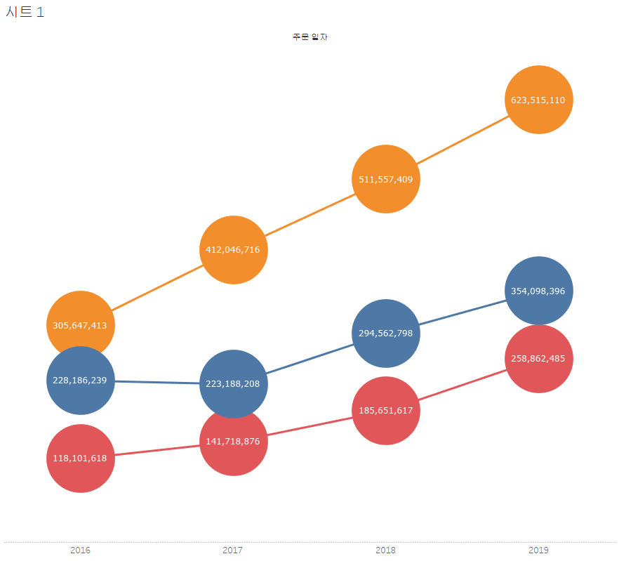

## 연도별 주문 금액 및 재구매 패턴 분석

### 연도별 주문 금액 변화

이 그래프는 2016년부터 2019년까지 세 가지 카테고리(또는 그룹)의 연도별 주문 금액 변화를 나타냅니다.

- **소비자**: 가장 높은 주문 금액을 기록한 그룹으로 매년 꾸준히 성장하고 있습니다. 
  - 2016년에 약 **305,647,413**, 2019년에 약 **623,515,110**을 기록했습니다.
  
- **기업 고객**: 중간 수준의 주문 금액을 기록하며 꾸준한 성장을 보였습니다.
  - 2016년에 약 **228,186,239**, 2019년에 약 **354,098,396**으로 증가했습니다.

- **홈 오피스**: 초기에는 낮은 수치였으나 빠르게 성장하여 2019년에 약 **258,862,485**를 기록했습니다.

# 3. 고객 세그먼트 별 매출액 누적 막대 그래프

## 연도별 매출 분석 (2016-2019)

이 그래프는 2016년부터 2019년까지 **소비자**, **기업 고객**, **홈오피스** 부문별 매출을 보여주는 누적 막대 그래프입니다. 각 색상은 다음과 같은 부문을 나타냅니다:

- **주황색:** 소비자
- **파란색:** 기업 고객
- **빨간색:** 홈오피스

### 연도별 매출 데이터

| 연도   | 총 매출         | 소비자 (주황색)   | 기업 고객 (파란색) | 홈오피스 (빨간색) |
|--------|-----------------|-------------------|--------------------|-------------------|
| **2016** | 651,935,270     | 305,647,413       | 228,186,239        | 118,101,618       |
| **2017** | 776,953,801     | 412,046,716       | 223,188,208        | 141,718,876       |
| **2018** | 991,771,824     | 511,557,409       | 294,562,798        | 185,651,617       |
| **2019** | 1,236,475,991   | 623,515,110       | 354,098,396        | 258,862,485       |

### 주요 포인트
1. **전체 매출**은 해마다 꾸준히 증가하고 있습니다.
2. 각 부문별로 살펴보면:
   - **소비자 부문**은 매년 큰 폭으로 성장하고 있으며 2019년에 가장 높은 매출을 기록했습니다.
   - **기업 고객 부문**은 꾸준히 성장하고 있지만 상대적으로 완만한 증가세를 보입니다.
   - **홈오피스 부문**은 가장 작은 비중을 차지하지만 매년 상승세를 보이고 있습니다.

### 시각적 설명
- **2016년**: 소비자 부문이 가장 큰 비중을 차지하며 홈오피스는 상대적으로 작은 비중을 차지함.
- **2017년**: 소비자 부문의 성장이 두드러지며 홈오피스 부문도 소폭 상승.
- **2018년**: 모든 부문에서 고른 성장이 이루어졌으며 특히 소비자와 기업 고객 부문의 성장이 눈에 띔.
- **2019년**: 소비자와 홈오피스의 급격한 성장이 눈에 띄며 전체 매출에서 큰 비중을 차지함.

# 4. 연도 별 매출액 누적 영역 차트 

## 영역 차트 분석 (2016-2019)

이 영역 차트는 2016년부터 2019년까지의 매출 변동을 분기별로 보여줍니다. 주로 **총 매출**의 추세를 시각적으로 표현하며, 매출이 분기마다 어떻게 변동했는지 한눈에 파악할 수 있습니다.

### 주요 포인트

1. **매출의 전반적인 증가**
   - 그래프에서 보이는 것처럼, 2016년 이후로 전체 매출은 꾸준히 증가하는 추세를 보입니다.
   - 특히 2019년 4분기에 급격한 매출 상승이 눈에 띕니다.

2. **분기별 매출 변동**
   - **2016년 3분기**와 **2017년 4분기**에서 매출이 크게 상승한 후, 다시 하락하는 패턴이 반복됩니다.
   - **2019년 4분기**는 가장 높은 매출을 기록하며, 이전 분기들과 비교해 큰 폭의 성장을 보여줍니다.

3. **변동성**
   - 각 연도의 분기별 매출은 일정하지 않으며, 특정 분기에 급격히 상승했다가 다음 분기에 하락하는 패턴을 보입니다.
   - 예를 들어, **2017년 4분기**와 **2018년 2분기** 사이에 큰 폭의 하락이 나타났습니다.

### 연도별 분석

- **2016년**: 비교적 낮은 수준에서 시작하였으나, 3분기에 급격한 상승 후 다시 하락.
- **2017년**: 전반적으로 상승세를 유지했으나, 4분기에 최고점을 찍고 이후 하락.
- **2018년**: 중간에 약간의 하락이 있었지만, 연말로 갈수록 다시 회복.
- **2019년**: 꾸준한 상승세를 보이며, 특히 마지막 분기에 가장 큰 성장을 기록.

### 결론
이 영역 차트는 각 연도와 분기별로 매출의 변동성을 명확하게 보여주며, 특히 **연말(4분기)** 에 매출이 크게 증가하는 경향을 확인할 수 있습니다. 이는 계절적인 요인이나 특정 이벤트(예: 블랙 프라이데이, 연말 프로모션 등)와 관련 있을 가능성이 있습니다.

# 5. 월 별 매출액 연도 비교 라인 그래프

### 매출 연도 라인 비교 그래프 (2018 vs 2019)

이 그래프는 **2018년(초록색)** 과 **2019년(노란색)** 의 월별 매출을 비교한 라인 차트입니다. 각 색상은 해당 연도의 매출 변동을 나타내며, 두 해의 매출 추이를 한눈에 비교할 수 있습니다.

## 주요 포인트

1. **2019년(노란색)** 이 전반적으로 **2018년(초록색)** 보다 높은 매출을 기록했습니다.
   - 특히 **7월**과 **10월**에 큰 차이가 발생하며, 2019년이 2018년에 비해 더 큰 성장세를 보였습니다.
   
2. **2018년과 2019년의 매출 패턴**
   - 두 해 모두 비슷한 패턴을 보이지만, 2019년은 대부분의 달에서 더 높은 매출을 기록했습니다.
   - **3월**, **6월**, 그리고 **11월**에는 두 해 간의 매출 차이가 상대적으로 적었으나, **7월**과 **10월**에 큰 폭으로 차이가 발생했습니다.

3. **가장 높은 매출 달**
   - 2019년은 **10월**에 가장 높은 매출(158,914,030)을 기록했습니다.
   - 2018년은 **6월**에 가장 높은 매출(137,350,531)을 기록했으며, 이는 2019년의 최고점보다는 낮습니다.

4. **매출 감소 추세**
   - 2019년과 2018년 모두 연말로 갈수록 매출이 감소하는 경향이 있습니다. 특히, **12월**에 두 해 모두 매출이 하락하는 모습이 보입니다.
   
## 월별 매출 비교

| 월   | 2018년 매출 (초록색) | 2019년 매출 (노란색) |
|------|----------------------|----------------------|
| 1월  | 78,685,345           | 68,070,803           |
| 2월  | 59,071,183           | 85,917,041           |
| 3월  | 52,332,758           | 61,224,718           |
| 4월  | 41,639,069           | 52,332,758           |
| 5월  | 103,121,223          | 110,227,022          |
| 6월  | 137,350,531          | 103,121,223          |
| 7월  | 70,494,255           | 125,888,947          |
| 8월  | 66,498,657           | 115,648,990          |
| 9월  | 100,252,421          | 145,058,897          |
| 10월 | 98,800,593           | 158,914,030          |
| 11월 | 88,194,579           | 123,693,563          |
| 12월 | 99,326,426           | -                    |

## 결론

- **매출 성장은 주로 여름과 가을에 집중**되어 있으며 특히 **7월**, **10월**, 그리고 **11월**에 두드러집니다.
- **2019년**은 대부분의 달에서 **2018년보다 더 높은 성과**를 기록했으며 연간 총매출에서도 뚜렷한 차이를 보였습니다.

# 6. 지역 별 매출액 합계 라운드 형 막대 그래프 비교

## 지역별 매출 그래프 해석

이 그래프는 **지역별 매출**을 시각적으로 나타내고 있습니다. 각 지역에 대한 매출 수치는 다음과 같습니다:

| 지역   | 매출 (원)            |
|--------|----------------------|
| 수도권 | 1,728,958,636         |
| 영남   | 899,126,312           |
| 호남   | 443,745,352           |
| 충청   | 440,588,435           |
| 강원   | 144,718,150           |

### 주요 해석
- **수도권**: 1조 7억 원 이상의 매출로 가장 높은 수치를 보이고 있습니다.
- **영남**: 약 9억 원의 매출로 두 번째로 높은 매출을 기록했습니다.
- **호남**과 **충청**: 각각 약 4억 원대의 비슷한 매출을 기록했습니다.
- **강원**: 약 1억 원대의 매출로 가장 낮은 수치를 보였습니다.

### 결론
수도권의 매출이 다른 지역에 비해 압도적으로 높으며, 영남이 그 뒤를 따르고 있습니다. 호남과 충청은 비슷한 수준의 매출을 기록했으며, 강원은 비교적 낮은 매출을 보였습니다.

# 7. 연도별 월간 매출 평균 기준 그래프 

## 1. 연도별 월간 매출 그래프 (2016-2019)

이 그래프는 **2016년부터 2019년까지의 월별 매출**을 보여줍니다. 각 연도별로 월간 매출의 변동을 시각화했으며, 주요 특징은 다음과 같습니다:

| 연도 | 평균 매출 (원)     |
|------|------------------|
| 2016 | 76,190,352       |
| 2017 | 64,746,150       |
| 2018 | 82,647,552       |
| 2019 | 103,039,666      |

### 주요 해석
- **2016년**: 평균 매출은 약 76M으로, 하반기(특히 10월~12월)에 매출이 급격히 증가했습니다.
- **2017년**: 평균 매출이 약간 감소하여 약 64M을 기록했으나, 하반기에도 여전히 매출 상승세가 보입니다.
- **2018년**: 평균 매출이 다시 증가하여 약 82M을 기록했으며, 특히 **5월**과 **12월**에 큰 폭의 매출 상승이 있었습니다.
- **2019년**: 가장 높은 평균 매출인 약 103M을 기록했으며, **5월**과 **10월~12월**에 걸쳐 매우 높은 매출을 보였습니다.

### 결론
매년 하반기에 매출이 급증하는 경향이 있으며, 특히 **12월**은 모든 연도에서 가장 높은 매출을 기록하는 시기입니다. 또한 **2019년**은 전반적으로 가장 높은 매출을 기록한 해입니다.

# 8. 제품명 계층 그래프 

이 그래프는 다양한 가전제품의 매출을 나타내는 막대 그래프입니다. 아래는 그래프의 내용을 해석한 것입니다:

## 제품별 매출 분석
제품 카테고리: 모두 가전제품

### 브랜드 및 제품명:
- KitchenAid:
- Toaster: White, Silver, Red, Black
- Stove: White, Silver, Red, Black
- Refrigerator: White, Silver, Red
- Microwave: White, Silver, Red, Black
- Coffee Grinder: 여러 색상
- Blender: Silver, Black
- Hoover:
- Toaster: White, Silver, Red, Black
- Stove: White, Silver, Red, Black
- Refrigerator: White, Silver, Red, Black

### 매출 분석
가장 높은 매출을 기록한 제품은 **Hoover Stove (Black)** 으로 약 36M.
**KitchenAid Stove (Black)** 도 높은 매출을 기록.
**Hoover Refrigerator (White)** 와 **KitchenAid Refrigerator (Silver)** 도 상당한 매출 기록.
Coffee Grinder와 Blender는 상대적으로 낮은 매출.

# 9. 지역 별 계층 그래프

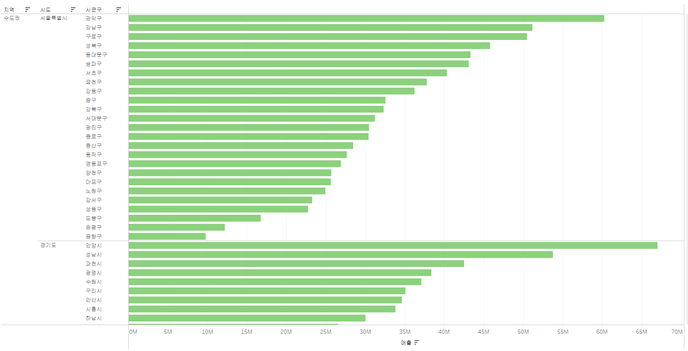

이 그래프는 전국의 매출을 나타내는 막대 그래프 입니다. 

# 10. 지리적 역할 그래프 

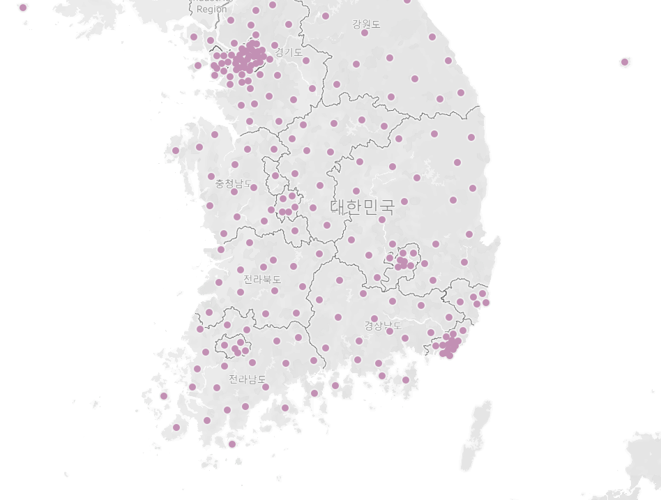

# 11. 채워진 맵 

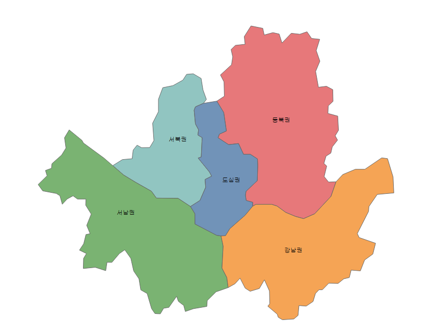

# 12. 기호 맵 

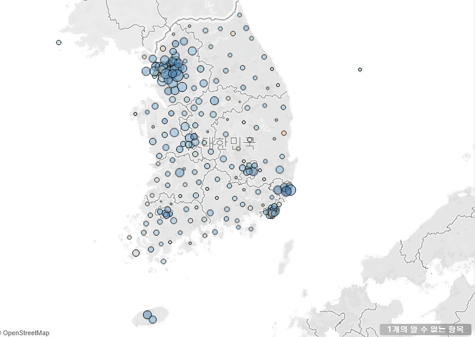

# 13. 이중 축 맵 

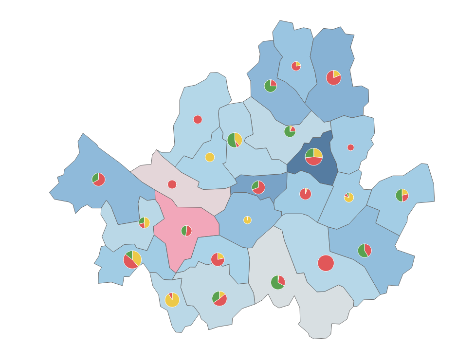

## 지도 해석

### 1. 지역 색상
- 파란색: 높은 값을 나타내는 지역
- 분홍색: 낮은 값을 나타내는 지역

### 2. 파이 차트 구성
- 빨간색: 첫 번째 범주
- 초록색: 두 번째 범주
- 노란색: 세 번째 범주

### 3. 특징적인 지역
- 중앙의 짙은 파란색 지역: 초록색 비율이 높음

# 14. 수도권과 기타 지역 매출 영역 그래프

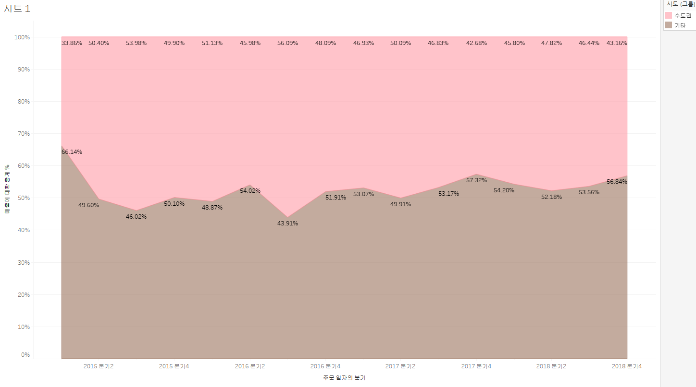 

## 수도권 vs 기타 지역 매출 비율 변화 (2015년~2018년)

### X축
- 2015년 2분기부터 2018년 4분기까지의 시간 흐름

### Y축
- 매출에 대한 총 비율(%)

### 색상
- 분홍색: 수도권의 매출 비율
- 갈색: 기타 지역의 매출 비율

### 주요 관찰점
1. 수도권의 매출 비중은 대체로 50% 이상이며, 분홍색 영역이 더 넓음.
2. 기타 지역의 매출 비중은 상대적으로 낮지만, 특정 시점에서 수도권과 유사한 수준으로 상승함.
3. 예외적으로, 2016년 4분기와 2017년 4분기에 기타 지역이 수도권보다 높은 매출 비중을 차지함.

# 15. 고객 매출 상위 그래프 

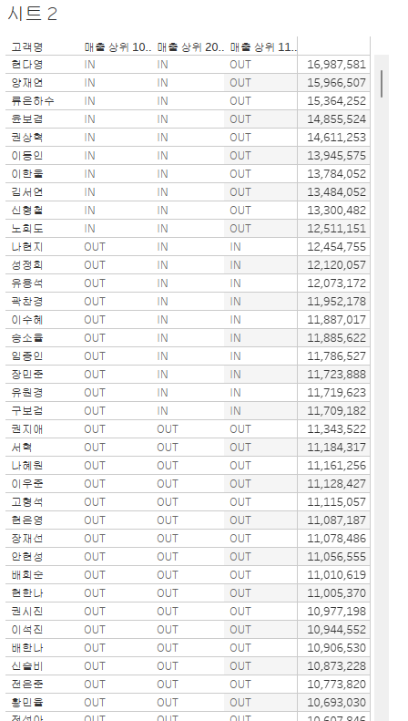

# 16. 박스 플롯 그래프

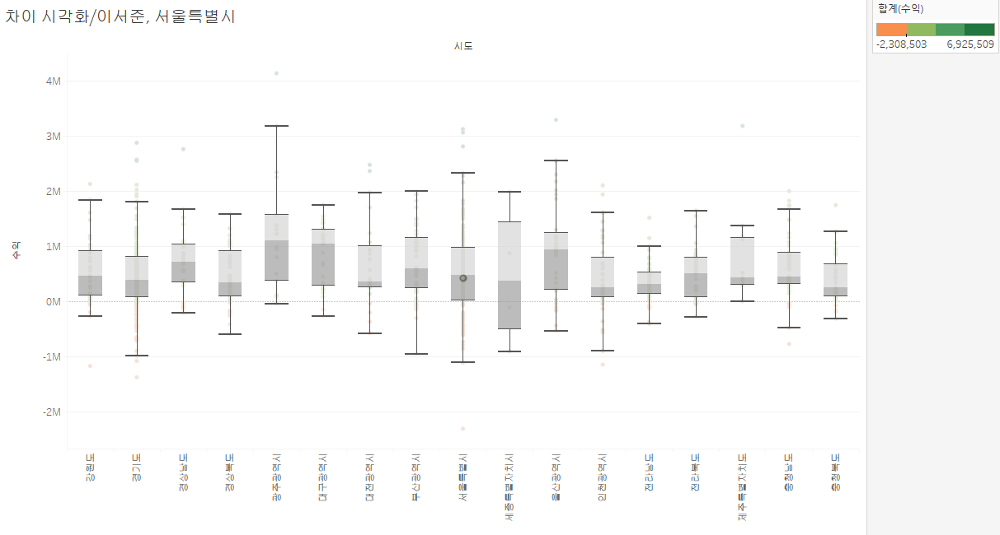

## 서울특별시 구별 수익 분포 박스 그래프 분석

### 박스 그래프 요소 설명
- **박스(Box)**: 각 구별로 수익의 1사분위(Q1)와 3사분위(Q3) 사이의 범위를 나타냄.
- **중앙값(Median)**: 박스 내부에 있는 가로선은 해당 구의 수익 중앙값을 나타냄.
- **수염(Whiskers)**: 데이터의 최소값과 최대값을 나타냄 (이상치 제외).
- **이상치(Outliers)**: 박스와 수염 밖에 위치한 점들은 일반적인 범위를 벗어난 이상치.

### 주요 분석 내용
- 대부분의 구는 중앙값이 0에 가까운 값을 보이며, 큰 변동 없이 안정적인 수익 분포를 보임.
- 일부 구(예: 서울특별시, 강남구)는 넓은 범위와 다수의 이상치를 보여, 큰 수익 변동이 발생했음을 시사함.
- 반면 다른 일부 구는 좁은 범위를 가지며, 이는 상대적으로 작은 변동을 의미함.

### 결론
서울특별시 내 여러 구에서 수익 분포가 다르게 나타나며, 특정 지역에서는 더 큰 변동성과 이상치가 관찰됨.

# 17. 고객 세그먼트 별 매출 파이 차트

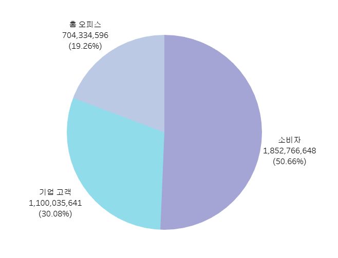

## 파이차트 데이터 해석

### 카테고리별 데이터

- **소비자 (Consumers)**: 1,852,766,648 (50.66%)
- **기업 고객 (Corporate)**: 1,100,035,641 (30.08%)
- **홀 오피스 (Retail)**: 704,334,596 (19.26%)

### 요약
이 파이차트는 소비자가 전체의 절반 이상인 50.66%를 차지하며 가장 큰 비중을 차지하고 있습니다. 그다음으로 기업 고객이 30.08%, 홀 오피스가 19.26%의 비율을 차지하고 있습니다.

# 18. 고객 세그먼트 별 도넛 차트 그래프 

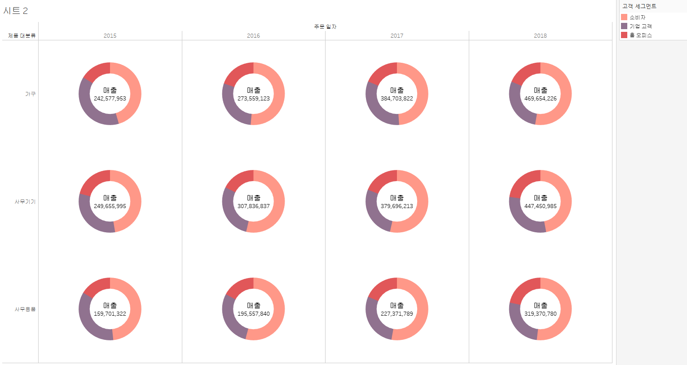

## 고객 세그먼트별 매출 도넛 차트 분석

### 고객 세그먼트 및 매출 비율

- **소비자 (Consumers)**: 1,852,766,648 (50.66%)
- **기업 고객 (Corporate)**: 1,100,035,641 (30.08%)
- **홀 오피스 (Retail)**: 704,334,596 (19.26%)

### 요약
이 도넛 차트는 고객 세그먼트별로 매출 비율을 시각적으로 나타냅니다. 소비자가 전체 매출의 절반 이상인 50.66%를 차지하며 가장 큰 비중을 차지하고 있습니다. 기업 고객은 30.08%, 홀 오피스는 19.26%의 비율을 기록하고 있습니다.

# 19. 할인율에 따른 수익 분포 그래프 

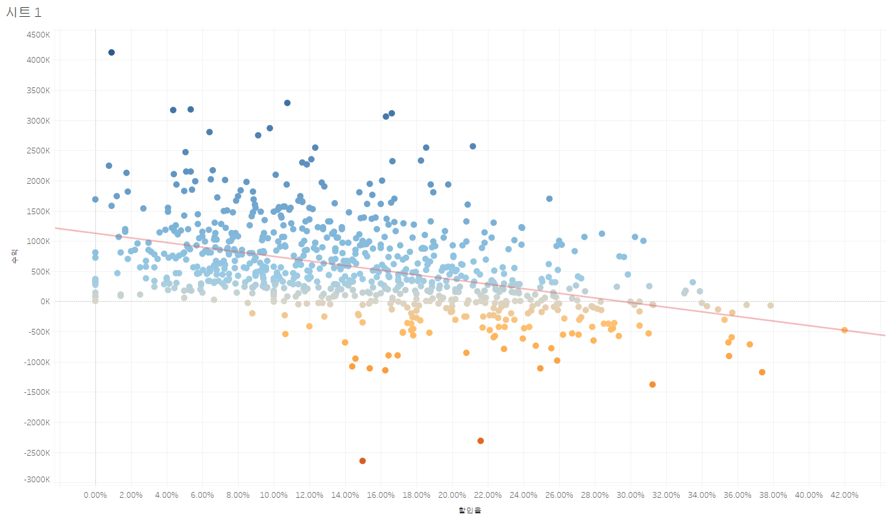 

## 할인율 vs 수익

### 그래프 설명
- **X축**: 할인율 (%)
- **Y축**: 수익 (단위: K)
- **색상**: 수익의 크기를 나타내며, 파란색에서 주황색으로 갈수록 수익이 낮아짐.
- **추세선**: 빨간색 선은 할인율과 수익 간의 선형 회귀 추세를 나타냄.

### 해석
- **할인율과 수익의 관계**: 할인율이 증가할수록 수익이 감소하는 경향을 보입니다. 이는 할인율이 높아질수록 매출은 증가하더라도, 이익은 줄어드는 현상을 나타낼 수 있습니다.
- **데이터 분포**: 대부분의 데이터는 할인율이 0%에서 30% 사이에 몰려 있으며, 수익의 범위는 -2000K에서 4000K 사이로 분포됩니다.
- **색상 변화**: 파란색(높은 수익)에서 주황색(낮은 수익)으로 변하는 것을 볼 때, 할인율이 높아질수록 낮은 수익을 기록하는 경향이 강합니다.

### 결론
할인율이 높아질수록 수익이 감소하는 경향을 보이며, 이는 가격 할인이 매출에는 긍정적일지 몰라도 이익에는 부정적인 영향을 미칠 가능성을 시사합니다.

# 20. 제품 별 수익 순위 트리맵 

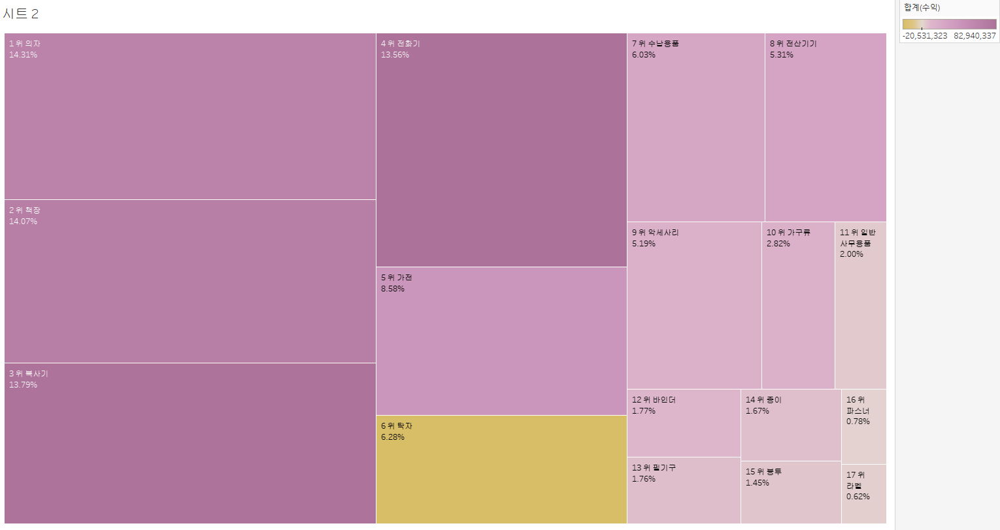

## 트리맵 그래프 분석

### 그래프 설명
- **트리맵 구조**: 각 사각형은 항목별 수익 비율을 나타내며, 크기가 클수록 해당 항목이 차지하는 비중이 큽니다.
- **색상**: 색상은 수익의 크기를 나타내며, 오른쪽 상단의 색상 범례에 따르면 노란색에 가까울수록 수익이 높고, 보라색에 가까울수록 수익이 낮습니다.

### 주요 항목 분석
1. **1위 의자 (14.31%)**: 가장 큰 비중을 차지하며, 전체 수익의 약 14.31%를 차지합니다.
2. **2위 칼 (14.07%)**: 의자와 거의 비슷한 비율로, 두 번째로 높은 수익을 기록합니다.
3. **3위 터치기 (13.79%)**: 세 번째로 높은 비율을 차지하며, 상위 항목 중 하나입니다.
4. **4위 전자기기 (13.56%)**: 네 번째로 큰 항목으로, 상위 4개 항목이 전체 수익의 절반 이상을 차지합니다.
5. **5위 가전 (8.58%)**: 중간 정도의 비중을 차지하며, 상위 5개 항목 중 가장 낮은 비율입니다.
6. **6위 박자 (6.28%)**: 노란색으로 표시되어 있어 상대적으로 높은 수익을 기록한 항목입니다.

### 기타 항목
- **7위 수납용품 (6.03%)** 부터 **17위 라벨 (0.62%)** 까지는 비교적 작은 비중을 차지하며, 특히 하위 항목일수록 수익 기여도가 낮습니다.

### 결론
- 상위 4개의 항목(의자, 칼, 터치기, 전자기기)이 전체 수익의 절반 이상을 차지하고 있으며, 이들 항목에 대한 집중적인 관리가 필요할 것으로 보입니다.
- 색상으로 볼 때 일부 항목(예: 박자)이 상대적으로 높은 수익을 기록하고 있으므로, 이러한 항목에 대한 추가적인 분석이 필요할 수 있습니다.

# 21. 연간 매출과 월간 매출 하이라이트 그래프 

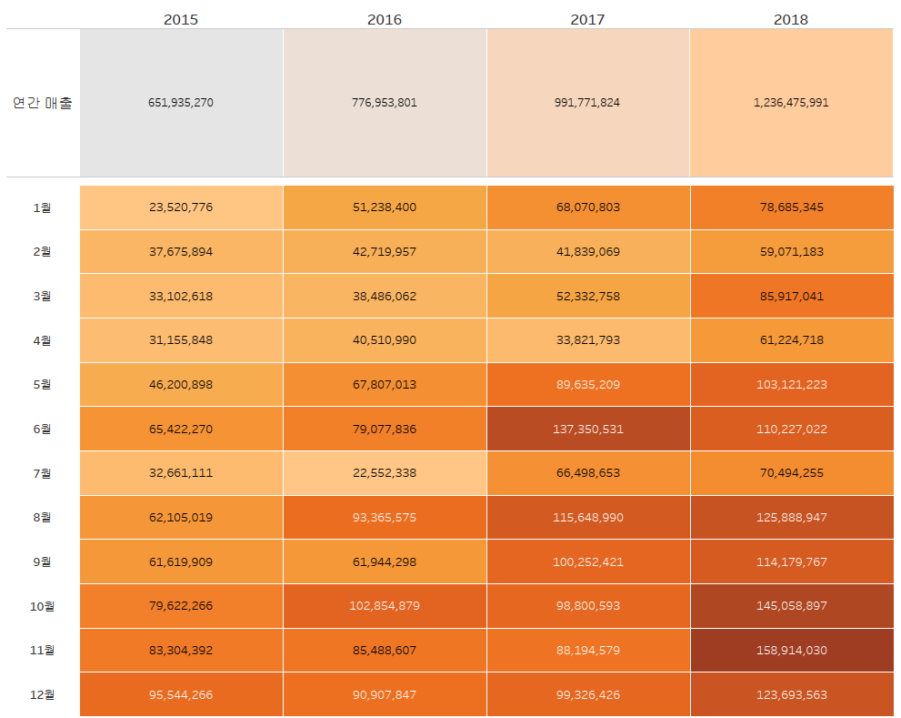

